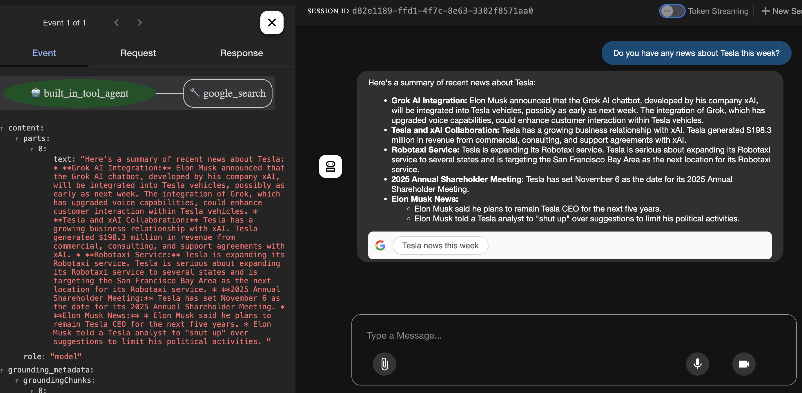

# Google Agent Development Kit (ADK) Basics

## Environment Setup

The [`requirements.txt`](./requirements.txt) defines all dependencies needed for the agent 
development environment. Execute the following command to create the virtual environemnt and
install all the defined dependencies.

```
python -m venv .venv
source .venv/bin/activate
pip install -r requirements.txt
```

Go to https://console.cloud.google.com to create a new Google Cloud project, then go to
https://aistudio.google.com/ to create the API Key.

## Basic Agent

Create the most basic [`greenting_agent`](./BasicAgent/greeting_agent/) agent which asks for 
username and greets the user. Execute `adk web` to debug the agent.

## Tool Agent

### Built-in tools

In [this example](./ToolAgent/google_search_tool_agent/agent.py), an agent which has access to the `google_search` internal tool is implemented. See this screenshot:



### Function tools

In [this example](./ToolAgent/two_function_tools_agent/agent.py), an agent which queries 
Database for order and inventory status is implemented. See this screenshot:


### Third Party tools

Agent could also be designed to integrate tools from other AI Agent frameworks like LangChain.

## LiteLLM

Register a https://openrouter.ai/ account and add some credit, then create an API Key and put 
it in the `.env` file in the agent's directory.

In [this example](./LiteLLMAgent/dad_joke_agent/agent.py), an agent which asks Open AI gpt-4.1-nano model to execute `get_dad_joke()` tool is implemented. See this screenshot:


## Structring Data

* `input_schema` (Optional): Expected input structure. This might not be very useful.
* `output_schema` (Optional but highly recommended): Define a schema representing the desired 
output structure. If set, the agent's final response must be a JSON string conforming to this 
schema.
* `output_key` (Optional): If set, the text content of the agent's final response is 
automatically saved to the session's state dictionary under the `output_key`. See the 
screenshots below:


## Session, State and Runners

### Session
A "Session" can be interpreted as a "Stateful chat history" or a "Conversation 
Thread". `Session` is an ADK object designed to store the "Conversation Thread". It includes:
  * `id` -- An identifier for the specific "Conversation Thread".
  * `events` -- A chronological sequence of all interactions, including "user messages", 
  "agent responses" and "tool actions".
  * `state` -- A dictionary storing temporary data relevant only to this specific 
  "Conversation Thread".

[This script](./SessionStateRunners/session_example.py) creates a session and print its 
important properties to the console. See its execution output below:
```
% python SessionStateRunners/session_example.py 
This is a program to exam Session object Properties
----- Session Properties -----
ID (`id`): e9faf650-a30b-44c8-b8be-2b19955a3301
Application Name (`app_name`): my_app
User ID (`user_id`): example_user
State (`state`): {'initial_key': 'initial_value'}
Events (`events`): []
Last Update (`last_update_time`): 1752375458.8551521
------------------------------
```

* `SessionService` -- The central manager responsible for the entire lifecycle of the 
conversation sessions.

**TODO: Add an image showing the structure of a `SeSessionService` object.**

### Runner

**TODO: Add an image showing the `Runner` workflow.**

* Step 1: `User` sends the query (`user_message`) to the Runner
* Step 2. Runner loads or creates the session and add appends `user_message` to the session 
history via `SessionService`.
* Step 3: Runner passes the context to the `Agent_Llm` which requests the `LLM` and executes the 
Tools per `LLM`'s response. Runner also updates the Session, including State and Events. Assume 
`Agent_Llm` decides to call `MyTool`, below are the detailed sub-steps:
  * Step 3.1: `Agent_Llm` receives `FunctionCall` response from `LLM` and `yields` an FunctionCall `Event`.
  * Step 3.2: `Runner` receives the `Event(FunctionCall)` from `Agent_Llm`. `SessionService` records it in the history. `Runner` yields `Event(FunctionCall)` to the `User`.
  * Step 3.3: `Agent_Llm` resumes to execute the requested `MyTool` by calling 
  `tool.run_async(...)`.
  * Step 3.4: `Agent_Llm` gets the tool execution result and yield `Event(FunctionResponse)` to 
  the `Runner`.
  * Step 3.5: `Runner` receives the `Event(FunctionResponse)` from `Agent_Llm`. `SessionService` 
  records the `Event(FunctionResponse)` and updates the underlying `Session`. `Runner` yields 
  `Event(FunctionResponse)` to the `User`.
  * Step 3.6: `Agent_Llm` resumes to send the tool result to the `LLM` to generate a natural 
  langauge response.
  * Step 3.7: `Agent_Llm` receives the final text from `LLM`, wraps it in the response to the 
  `Runner`.
* Step 4: `Runner` responds the final result / completion to the user.

In [this example](./BasicStatefulSession/basic_stateful_session.py), a `InMemorySessionService` 
is created. And it asks
[the Question Answering Agent](./BasicStatefulSession/question_answering_agent/agent.py) a 
question about the user's preference. The user's preference is provided to the LLM in the system
prompt. See its execution output below:

```
% python basic_stateful_session.py
A new session has been created. Session ID: 7f39473e-247b-4fa6-be79-cd65337f48d9
Final response: Yue's favorite TV show is The Big Bang Theory.

===== Session Event Exploration: Final Session State =====
user_name: Yue Yu
user_preference: 
    I like to play tennis and soccer.
    My favourite food is Chinese.
    My favourite TV show is The Big Bang Theory.
    Loves it when other engineers approve and merge his Pull Requests.
```

## Persistent Storage

In [this example](./PersistentStorage/main.py), a `DatabaseSessionService` is created and it 
interacts with [the Memory Agent](./PersistentStorage/memory_agent/agent.py) to manage a reminder
list. See the test case below:

**TODO: Write a few test scenarios to prove this example works.**

## Multi Agent

* A Multi-Agent System is an advanced pattern in the ADK that allows multiple sepcialized agents to 
work together to handle complex tasks.
* Difference between Agent-as-a-tool and Sub-agent:
  * When Agent A calls Agent B as a tool (using Agent-as-a-tool). Agent B's answer is passed back 
  to agent A, which then summarizes the answer and generates a response to the user. **Agent A 
  retains control and continues to handle future user input.**
  * Sub-agent: When Agent A calls Agent B as a sub-agent, **the responsibility of answering the 
  user is completely transferred to Agent B**. Agent A is out of the loop.
* [Example](./MultiAgentsSystem/root_agent/agent.py)
  * Below is the system diagram for this example:

  

    * Note: `news_analyst` can only be an `AgentTool` in that it calls the built-in tool.
  * General workflow: Please tell me a funny joke. Then get the latest price of Microsoft, and its 
  latest news:
  * Due to `funny_nerd` is designed as a Sub-agent. The `root agent` takes a `transfer_to_agent` 
  action .
  * The `funny_nerd` decides to use the `get_nerd_joke` tool to return the corresponding joke to 
  the input topic. See the screenshot below:

  
  
  * Then, I asked the agent to provide the latest Microsoft stock price. It is able to automatically
  transfer to `stock_analyst` agent and utilize the `get_stock_price` tool. See screenshot below:

  

  * Finally, I asked the latest news on Microsoft. Initially, the agent unable to perform. I asked 
  it to delegate the the root agent. It does a `transfer_to_agent` action and use the underlying 
  `google_search` tool. See the screenshot below:

  

## Stateful Multi Agent System

**TODO: Add some basic concepts about Stateful Multi Agent System.**

* Test cases:
  * Question 1: Can you please buy Intro to AI course for me?
  * Question 2: Can I kindly ask the content for Advanced AI course?
  * Question 3: Then I want to buy the Advanced AI course.
  * Question 4: What is the content for Introduction to AI?
  * Question 5: I don't want to take Hands-on AI course anymore, can you do me a refund?

## Callbacks

* The diagram below shows the how different callbacks are defined:

  

* Agent Lifecycle Callbacks
  * `before_agent_callback`: Runs right before the main logic of the agent starts. Useful for tasks 
  like setting up initial resources, validating session state, or logging the start of the agent's 
  activity. Can be used to skip the agent's execution entirely and provide an immediate response.
  * `after_agent_callback`: After the agent has finished its processing and has a final response 
  ready. A great place to modify the final output.
  * Demo on [the example](./Callbacks/before_after_agent/agent.py):

    
    